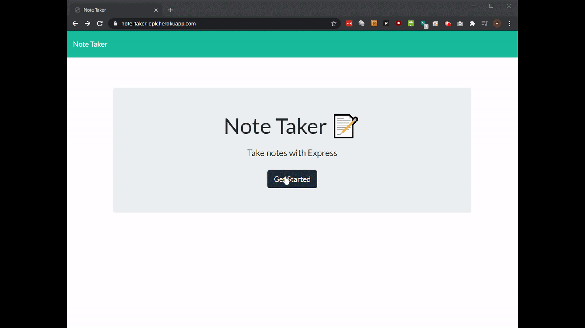

# Note Taker 
An app for creating, saving, editing and deleting plain text notes.

## Description
This is a simple note-taking app that allows the user to create, save, edit, and delete text-based notes.  The application was written with a JavaScript, HTML and CSS frontend.  The backend uses the Node.js JavaScript runtime environment and Express web framework.  The BootStrap CSS framework and Font Awesome icon pack were used for styling.

### Features include:
* Backend data-persistence of user created notes
* Ability to create, save, update and delete notes

[Link to the repository](https://github.com/pkriengsiri/note-taker)
  
## Table of Contents
* [Installation](#installation)
* [Usage](#usage)
* [Credits](#credits)
* [License](#license)
* [Contributing](#contributing)
* [Questions](#questions)
  
## Installation
From GitHub, fork the repo all upload all contents to the deployed webserver.  The server must have Node.js installed.  Once forked, run `npm i` from the root directory to install required dependencies.  If running locally, run `npm start` to start the webserver.

To deploy to Heroku, run `heroku create` then push to the newly created Heroku instance.
  
## Usage
Access the application at the deployed URL: https://note-taker-dpk.herokuapp.com/

* Press the pencil icon to create a note.  
  * The note will require title and text.  
  * When finished, click the save icon to save the note.
* Press the red delete icon to delete a note
* Press the blue edit icon to edit a note
  * A new modal window will appear
  * Edit the note title and/ or text within the new window
  * Click the blue save icon to save changes, or click the red cancel icon to discard changes





## Credits
Collaborators on this project included instructional staff, TAs, and students in the Georgia Tech Coding Boot Camp Winter 2020 cohort.

### References
* https://expressjs.com/en/starter/static-files.html 
* https://stackoverflow.com/questions/23662106/how-to-add-line-break-with-media-queries
* https://stackoverflow.com/questions/45456543/make-text-show-up-on-hover-over-button/45456596


## License
This application is covered under MIT License

<details>
  <summary>
    License Text
  </summary> 

```

Copyright (c) 2021  Pete Kriengsiri

Permission is hereby granted, free of charge, to any person obtaining a copy
of this software and associated documentation files (the "Software"), to deal
in the Software without restriction, including without limitation the rights
to use, copy, modify, merge, publish, distribute, sublicense, and/or sell
copies of the Software, and to permit persons to whom the Software is
furnished to do so, subject to the following conditions:
      
The above copyright notice and this permission notice shall be included in all
copies or substantial portions of the Software.
      
THE SOFTWARE IS PROVIDED "AS IS", WITHOUT WARRANTY OF ANY KIND, EXPRESS OR
IMPLIED, INCLUDING BUT NOT LIMITED TO THE WARRANTIES OF MERCHANTABILITY,
FITNESS FOR A PARTICULAR PURPOSE AND NONINFRINGEMENT. IN NO EVENT SHALL THE
AUTHORS OR COPYRIGHT HOLDERS BE LIABLE FOR ANY CLAIM, DAMAGES OR OTHER
LIABILITY, WHETHER IN AN ACTION OF CONTRACT, TORT OR OTHERWISE, ARISING FROM,
OUT OF OR IN CONNECTION WITH THE SOFTWARE OR THE USE OR OTHER DEALINGS IN THE
SOFTWARE.

```
</details>


## Contributing
No contributions are being accepted at this time.
  
## Badges
[](https://github.com/pkriengsiri/note-taker/issues)
[](https://github.com/pkriengsiri/note-taker/stargazers)
[](https://github.com/pkriengsiri/note-taker/blob/main/LICENSE)


## Questions
Contact me via [email](mailto:pkriengsiri@gmail.com).
View my GitHub [profile](https://github.com/pkriengsiri).
